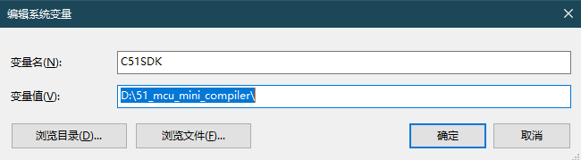

# MCUTerminal

#### 介绍
基于单片机的终端系统

#### 软件架构

该程序使用迷你SDK编译:

[Gitee链接>>](https://gitee.com/o70078/51_mcu_mini_compiler.git)

并使用VSCode编辑代码:

[免费下载地址>>](https://code.visualstudio.com/)

#### 安装教程

1. 下载迷你SDK,或者安装keil
1. 配置C51SDK环境变量内容为迷你SDK路径或者keil安装后的C51文件夹路径

#### 使用说明

1. 根据上面的**安装教程**配置环境
2. 双击build.bat编译输出Hex
3. 打开STC下载器,载入程序,推荐使用STC15或STC8系列芯片(不支持STC89系列,STC12系列)
4. 配置内部IRC震荡器,为30MHz
5. 对于IAP芯片,请将EEPROM大小设为64K(最大) 否则会出现flash命令读写位置不对齐的情况(原因参考STC官方文档里EEPROM章节)
6. main.c里面有一行代码,是配置串口转移的.在启用该代码的情况下,开机后**串口在P36 P37**,烧录时**串口在P30 P31**
